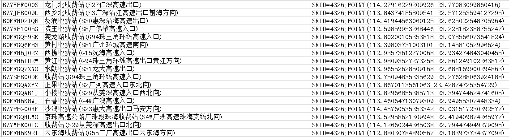
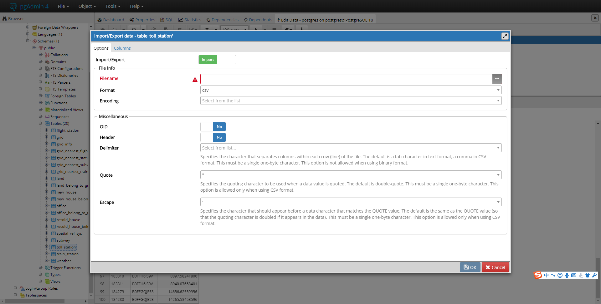
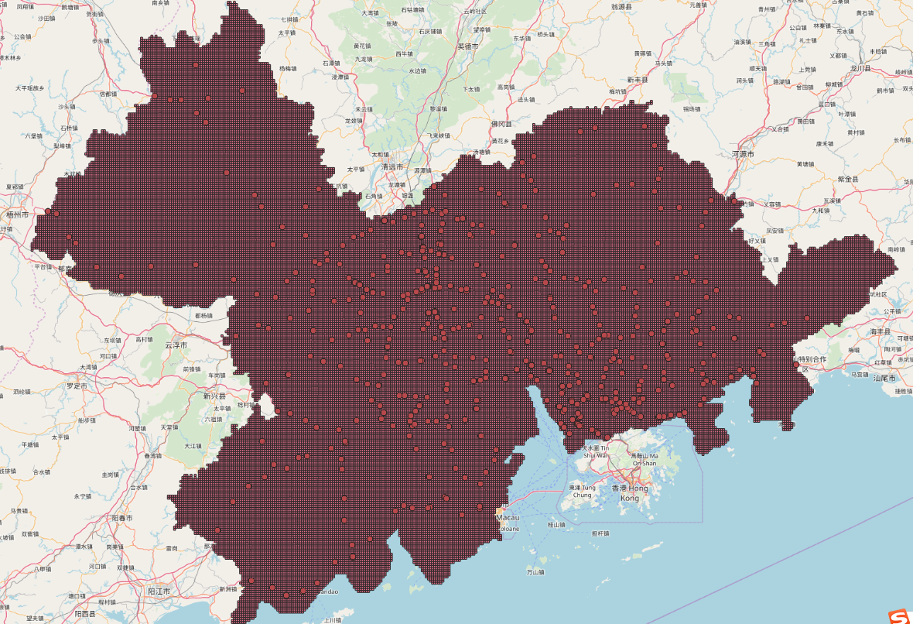

本篇文章主要介绍我在项目中处理空间数据时使用到的工具，因为确实非常方便，所以希望记录下来，分享给大家。或许一些大牛对此嗤之以鼻，但是希望能帮助像我一样的小白。

通过本文，你将学到


1. 什么是POSTGRES和POSTGIS


2. 如果将空间对象存入POSTGRES中


3. 如何利用POSTGIS进行KNN查询


4. 对空间对象建立索引加快查询速度


5. 如何可视化空间对象

## POSTGRES + POSTGIS

postgres是一个开源的关系型数据库，而postgis可以理解为是postgres的一个插件。当安装了postgits之后，可以在postgres中一个字段存储空间类型的数据， 比如一个Point，或者 Polygon。

如果不安装postgis， 想要存储一个空间上的Point， 则需要存储该点的经度(lng)和纬度(lat)，实际上是用了两个float的字段去表示一个Point。 而且这样存储后很难直接去比较两个空间对象之间的关系。

安装Postgis后，一个Point可以只存在一个字段上，该字段可以实实在在地表示一个空间点，并且可以很方便地使用一些Postgis自带的函数去比较两个空间对象。

在这次工作中

## 创建表

创建一个存储空间对象的表， 语法跟普通sql语句创建表类似。 例如一下创建了一个存储高速收费站信息的表, 表名为 `TOLL_STATION`。

```sql
CREATE TABLE TOLL_STATION (
    id text,
    name text,
    geom Geometry(Point, 4326)
);
```
表中的信息包括 1、收费站的`id`，text类型。 2、收费站的名称(`name`)， text类型。 3、`geom`， 收费站地理信息。这里字段的类型是 `Geometry(Point, 4326)`。

这里重点解释一下**Geometry**的类型。首先申明： 我按照我的理解通俗解释下Geomery，并不代表我的理解是正确的。txtx~

**Geometry**不是Postgres自带的数据类型，必须在数据库中“激活”了Postgis后才能使用。激活的方式是输入以下命令。

```sql
CREATE EXTENSION postgis
```

我们看到上面创建表时 Geometry中有两个参数，分别是`Point`, `4326`。其中`Point`指定了这个空间对象的类型， 即高速收费站是一个点， `4326`则规定了经纬度的坐标系是wgs84。

* 科普：经纬度坐标系分为 wgs84, bd09, gcj等，不同坐标系下的经纬度有轻微偏移，所以必须在相同坐标系下进行空间比较。

## 导入数据
当表创建好后，则需要导入数据。这里假设原来的数据在文件中，此时需要批量导入postgres数据库中。

首先， 数据格式应该如下所示：



**注意**在: 文件中没有表头！！！！如果存在表头，在后续导入会造成错误。

接下来，导入数据的方式有两种：

1. 命令行导入 ： `COPY TOLL_STATION FROM 'd:/postData/highway_toll_station_wgs.csv' delimiter ',';` `TOLL_STATION`是要导入的目标表名， `d:/postData/highway_toll_station_wgs.csv`是文件路径， `delimiter ','`则指定了读取文件时，每一行内数据的分隔符是逗号。
这里需要注意的一点是文件路径不要放在c盘目录下，这样子会报错 permission denied


2. 利用pgAdmin 4管理工具导入，具体如下图所示。




## 最近邻查询

在这里，我们需要完成的工作是计算每个网格到最近的高速收费站的距离。 如果使用其他编程语言，则需要写较多的代码，而在postgis里，只需要几行select语句就可以搞定。

首先，我们还创建了`GRID`表，用于存储网格信息。然后，我们为每个网格匹配最近的高速收费站，并计算距离。 具体的select语句如下

```sql
SELECT * into grid_nearest_station
FROM
(
    SELECT g.id AS grid_id, b.id AS station_id, b.d AS distance
    FROM GRID g
    CROSS JOIN LATERAL (
        SELECT s.id AS id, s.geom AS geom, st_distance_sphere(g.geom, s.geom) AS d
        FROM TOLL_STATION s
        ORDER BY g.geom <-> s.geom
        LIMIT 1
    )b
)AS table1
```

我们首先看嵌套的select语句，对于给定的网格， `g.geom<->s.geom`直接实现了计算两点之间的距离(非经纬度距离)，`LIMIT 1`和 `ORDER BY` 则返回最近的一条记录。  `st_distance_sphere(g.geom, s.geom)`计算两者之间的实际距离(经纬度距离)。
再看外层的select语句， `CROSS JOIN`用于做两个表的连接查询。 `LATERAL`的作用大致上是使得内层嵌套的select语句可以使用外层select语句的表内容。 在本语句中， 外层GRID表的内容用于子查询中的匹配。

##建立索引
首先附上官方教程：http://revenant.ca/www/postgis/workshop/indexing.html
然后介绍命令： `CREATE INDEX [index_name] ON [table_name] USING GIST ([column_name]);`

只需把[]里面的内容修改成你自己的即可。

## 验证(QGIS)
通过上一步我们已经得到了每个网格离最近的高速站点的距离，但是因为初次使用postgis，对于结果半信半疑，所以想要对结果进行验证。在这里，隆重介绍一个工具QGIS。

About QGIS： QGIS is a user friendly Open Source Geographic Information System (GIS) licensed under the GNU General Public License. QGIS is an official project of the Open Source Geospatial Foundation (OSGeo). It runs on Linux, Unix, Mac OSX, Windows and Android and supports numerous vector, raster, and database formats and functionalities.

QGIS可以直连Postgres数据库，然后将数据库中特定表的内容加载到空间上，同时可以添加OpenMap的layer，对于空间处理非常方便。下图就是我导入网格数据和高速收费站数据后的效果图。其中密集的点是一个个小网格， 圆圈是高速收费站。 通过直观的观察，我们可以验证一些网格的最近高速收费站是否匹配正确。 同时,QGIS还提供测距功能，测量两点之间的距离是否真的如之前查询所得一样。


## 结束语
至此，关于我在项目中使用POSTGIS处理空间对象的内容介绍完毕。 由于长时间没有使用数据库，曾经一度select语句都不会写了。 POSTGRES和POSTGIS的功能我也只用了九牛一毛， 例如还有判断一个对象是否被多边形包含的函数 ST_Contains。
这里的介绍如有错误欢迎批评指正。

Hope Enjoy！